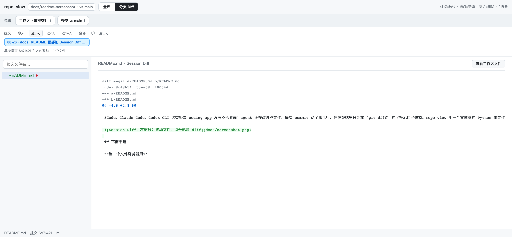

# repo-view

给终端里的 coding agent（和你自己）补一个可视化的「文件夹查看器 + Diff 查看器」。

ZCode、Claude Code、Codex CLI 这类终端 coding app 没有图形界面：agent 正在改哪些文件、每次 commit 动了哪几行，你在终端里只能靠 `git diff` 的字符流自己想象。repo-view 用一个零依赖的 Python 单文件在本机起个服务，浏览器里直接看。它本身就是一个 **Agent Skill**（自带 `SKILL.md`），agent 能自己把它拉起来、把链接发给你；你当然也可以脱离任何 agent 手动用。



## 它能干嘛

**当一个文件浏览器用**

- 任意本地目录瞬间变成一个可点击的网站：左侧文件树、右侧内容
- 语法高亮（TS / Go / Python / Markdown / JSON…几十种），图片、视频直接预览
- `/` 聚焦搜索文件名，`Esc` 清空

**当一个「这个仓库我最关心哪几块」的导航器用（快捷专区）**

- 启动时用 `--focus <相对路径>`（可重复）把常看的目录钉成侧栏顶部一排 chip，点一下树根就切到那个专区，点仓库名 chip 回全库；**默认永远是完整 repo 树**
- 浏览时 hover 任意文件夹，行尾出现 `＋`，点一下就钉进快捷专区；chip 上的 `✕` 移除
- 不想改启动命令？直接分享带种子的链接：`?focus=server/prompts,docs`；`?zone=server/prompts` 则打开直达专区
- 钉的目录按「仓库路径」存在浏览器 localStorage 里，每个仓库互不干扰；`--focus` 种子每次启动自动回来，页面里移除只对当次生效

**当一个 Diff 查看器用（Session Diff）**

三个粒度随便切，树里**只列有改动的文件**，点开默认就是 diff：

- **工作区**：还没 commit 的改动（含未跟踪新文件）vs HEAD
- **整支**：当前分支相对 main（自动探测 main/master/develop/dev）的全部提交改动
- **单个 commit**：这条分支上每一次提交各改了什么

文件树上红点 = 修改、绿点 = 新增、灰点 = 删除，一眼看出 agent 动了哪里。

**典型场景**

- agent 在干活，你浏览器里开一页 Session Diff 盯着：它现在改了哪些文件、改了什么，实时可见
- 让 agent 起服务把链接发你，亲眼确认它说的那个文件、那次改动
- review 一条分支：按 commit 从新到旧逐个过

## 快速开始

```bash
python3 serve.py <目录> [端口=8770] [--focus <相对路径>]...
# 浏览器打开 http://127.0.0.1:8770
# 直接进 Session Diff：
open 'http://127.0.0.1:8770/?mode=session'
# 例：看整个 repo，但把 prompts 钉成快捷专区：
python3 serve.py ~/Projects/myapp 8770 --focus server/prompts
```

零依赖：只要 Python 3 标准库，不用装任何包。

## 作为 Agent Skill 安装

把整个目录放进你 agent 的 skills 目录，例如：

```bash
git clone https://github.com/gemma1044/repo-view.git ~/.zcode/skills/repo-view
# 或 ~/.agents/skills/ 、~/.claude/skills/ 等，取决于你的 agent 读哪里
```

装好之后，你对 agent 说「看一下这个仓库」「打开 repo-view」「Session Diff」，它就会按 `SKILL.md` 自己启动并附上链接——不用你碰命令行。

## 安全与边界

- **只读**：不写磁盘、不执行仓库代码，没有任何写操作
- **只绑 127.0.0.1**：仅本机可访问，别把它暴露到公网
- 自动忽略 `node_modules` / `.git` / `dist` / `build` 等重目录；文本 >1MB 截断显示；文件数 >20000 拒绝
- 一个实例服务一个目录；换目录 = 换个端口再起一个
- 语法高亮走 cdnjs 的 highlight.js，离线自动降级为纯文本

## API 一览

| 路径 | 作用 |
|------|------|
| `/api/tree` | 全库文件树 |
| `/api/status` | `git status` 汇总（path → 新增/修改/删除） |
| `/api/file?path=` | 单文件内容/元信息 |
| `/api/raw?path=` | 原始字节（图片/视频用） |
| `/api/diff?path=` | 工作区单文件 diff vs HEAD |
| `/api/session` | 当前分支 Session 元信息（base 自动探测） |
| `/api/session/files?entry=` | 某条目（工作区/整支/commit）的改动文件树 |
| `/api/session/diff?entry=&path=` | 某条目下单文件 diff |

## License

MIT
